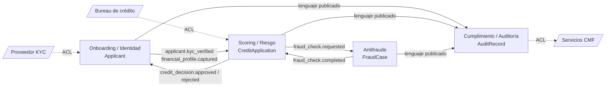

# Bounded contexts — CrediScore

Cuatro contextos, uno por servicio del [C4 L2](../c4/l2-container.png). La frontera se traza donde una misma palabra cambia de significado.

## El síntoma: "solicitante" no significa lo mismo en cada contexto

| Contexto | "Solicitante" es… | Agregado raíz |
| :--- | :--- | :--- |
| **Scoring / Riesgo** | Persona con perfil financiero y categoría de riesgo. | `CreditApplication` |
| **Onboarding / Identidad** | Persona con RUT validado, KYC y consentimiento. | `Applicant` |
| **Cumplimiento / Auditoría** | Referencia opaca a decisiones para la CMF. | `AuditRecord` |
| **Antifraude** | Nodo en una red de señales de riesgo y reglas. | `FraudCase` |

## Contextos

| Contexto | Servicio (C4 L2) | Persistencia | Patrones | Historias |
| :--- | :--- | :--- | :--- | :-: |
| **Onboarding / Identidad** | Onboarding Microservice | Aurora PostgreSQL + Redis (sesión y OTP) | Outbox | HU1 |
| **Scoring / Riesgo** | Scoring Engine Microservice | Aurora PostgreSQL (escritura) + OpenSearch (lectura) | Outbox, CQRS | HU2, HU5 |
| **Antifraude** | Fraud Detection Microservice | Neo4j / Neptune (grafo) + Redis (contadores de velocidad) | Saga: compensaciones | HU3 |
| **Cumplimiento / Auditoría** | Compliance Microservice | OpenSearch (búsqueda) + S3 (archivo inmutable) | Event Sourcing | HU4 |

El DER del contexto principal (Scoring / Riesgo) está en [der.png](der.png), con fuente en [der.puml](der.puml). La justificación de cada motor está en el [ADR 0004](../adr/0004-datos-y-eventos.md).

## Por qué estas fronteras

Cada contexto le da un significado distinto a "solicitante" y tiene un patrón de acceso distinto a sus datos, por eso cada uno usa el motor que calza con ese patrón (ADR 0004):

* **Onboarding / Identidad:** integridad referencial y joins.
* **Scoring / Riesgo:** escritura transaccional separada de las consultas del dashboard de analistas.
* **Antifraude:** redes de señales de riesgo, que un modelo relacional no analiza bien.
* **Cumplimiento / Auditoría:** búsqueda y archivo inmutable con el historial completo.

## Context map

| Relación | Patrón | Significado |
| :--- | :--- | :--- |
| Onboarding → Scoring | Cliente / proveedor | Scoring solo evalúa solicitudes con KYC verificado y perfil financiero capturado. |
| Scoring ↔ Antifraude | Asociación (*partnership*) | Ambos acuerdan los eventos; ninguno llama al otro de forma síncrona. |
| Todos → Cumplimiento | Lenguaje publicado | Auditoría consume el [catálogo de eventos](event-catalog.md) tal cual; no pide cambios a los productores. |
| KYC, Bureau, CMF | Capa anticorrupción (ACL) | Cada integración se traduce al modelo propio en un adaptador (Ports & Adapters, ADR 0003). |
