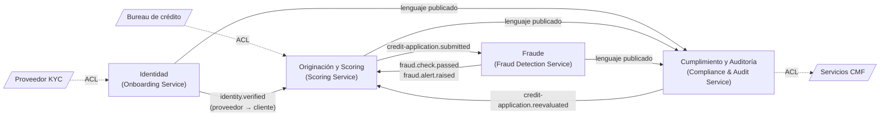

# Bounded contexts — CrediScore

Cuatro contextos, uno por servicio del [C4 L2](../c4/l2-container.png). La frontera se traza donde una misma palabra cambia de significado.

## El síntoma: "solicitante" y "solicitud" significan cosas distintas

| Contexto | "Solicitante" es… | "Solicitud" es… |
| :--- | :--- | :--- |
| **Identidad** | Una persona con RUT, cédula y verificación KYC. | No existe. |
| **Originación y Scoring** | Un `applicant_id` opaco con historial crediticio. | Un monto y un plazo que recorren estados hasta una decisión. |
| **Fraude** | Un dispositivo, una IP y un patrón de comportamiento. | Una señal a evaluar contra reglas y anomalías. |
| **Cumplimiento y Auditoría** | Una referencia opaca. | Un expediente: la secuencia inmutable de hechos y decisiones. |

## Contextos

| Contexto | Servicio | Persistencia | Agregado raíz | Lenguaje ubicuo | Historias |
| :--- | :--- | :--- | :--- | :--- | :-: |
| **Identidad** | Onboarding Service | PostgreSQL, schema `identity` | `Applicant` (con sus `IdentityVerification`) | solicitante, cédula, verificación, vigencia | HU1 |
| **Originación y Scoring** | Scoring Service | PostgreSQL, schema `origination`; modelos en S3 | `CreditApplication` (con `ScoreResult` y `Decision`) | solicitud, puntaje, banda de riesgo, decisión, clave de idempotencia | HU2, HU5 |
| **Fraude** | Fraud Detection Service | Redis (contadores y listas negras) | `FraudCheck` | alerta, regla, velocidad, lista negra, anomalía | HU3 |
| **Cumplimiento y Auditoría** | Compliance & Audit Service | PostgreSQL, schema `compliance`; archivo en S3 con Object Lock | `AuditRecord`, `Reevaluation` | expediente, re-evaluación, control normativo, carga financiera, fairness | HU4 |

El DER del contexto principal (Originación y Scoring) está en [der.png](der.png), con fuente en [der.puml](der.puml).

## Por qué estas fronteras

* **Identidad** concentra los datos personales. Aislarla limita quién puede leer un RUT y permite que el proveedor KYC falle sin detener solicitudes ya verificadas.
* **Originación y Scoring** van juntos porque la decisión es parte del ciclo de vida de la solicitud: separarlos obligaría a una transacción distribuida para cada cambio de estado.
* **Fraude** se separa por su atributo de calidad: debe responder en milisegundos y escalar por ráfagas, sin compartir recursos con la inferencia de ML.
* **Cumplimiento y Auditoría** se separa porque su dato no se puede modificar y porque quien audita no debe depender del servicio auditado.

## Context map

| Relación | Patrón | Significado |
| :--- | :--- | :--- |
| Identidad → Originación y Scoring | Cliente / proveedor | Scoring solo acepta solicitudes con una verificación aprobada; Identidad publica el resultado. |
| Originación y Scoring ↔ Fraude | Asociación (*partnership*) | Ambos equipos acuerdan los eventos; ninguno llama al otro de forma síncrona. |
| Todos → Cumplimiento y Auditoría | Lenguaje publicado | Auditoría consume el [catálogo de eventos](event-catalog.md) tal cual; no pide cambios a los productores. |
| KYC, Bureau, CMF | Capa anticorrupción (ACL) | Cada integración se traduce al modelo propio en un adaptador; el formato del tercero no entra al dominio. |

## Reglas entre contextos

1. Ningún servicio lee el schema de otro. No hay claves foráneas entre schemas.
2. Los contextos se refieren a la persona por `applicant_id`; el RUT solo existe en Identidad y en la petición de la API.
3. Toda comunicación entre contextos es por eventos del catálogo.
