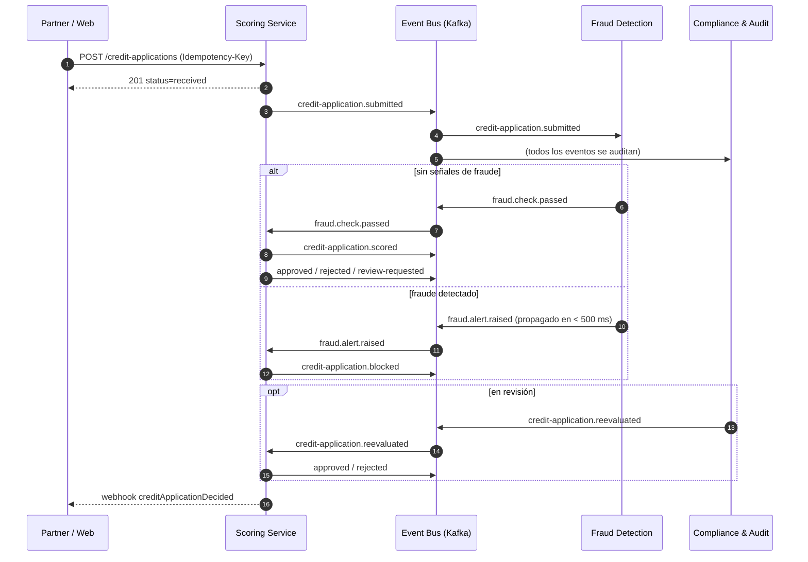

# Catálogo de eventos de dominio — CrediScore

Eventos del ciclo de vida de una solicitud de microcrédito. Las decisiones de broker, entrega y patrones están en el [ADR 0004](../adr/0004-datos-y-eventos.md).

## Reglas

* **Nombre:** `recurso.acción` en pasado. Un evento describe algo que ya ocurrió; no es un comando.
* **Inmutable:** un evento publicado no se modifica. Un cambio incompatible publica una versión nueva.
* **Entrega at-least-once:** todo consumidor es idempotente por `event_id`.
* **Orden:** la clave de partición es `aggregate_id`, así que los eventos de una misma solicitud llegan en orden.
* **Datos personales:** ningún evento lleva RUT, nombre, imágenes, género ni comuna. Los contextos se refieren a la persona por `applicant_id`.

## Sobre común

```json
{
  "event_id": "3d6f0a52-8c1b-4f7e-a2d9-0e1f2a3b4c5d",
  "event_type": "credit-application.submitted",
  "event_version": "1.0",
  "occurred_at": "2026-10-01T14:22:31Z",
  "aggregate_id": "7f3b6c1e-2a4d-4e8b-9c0f-1d2e3f4a5b6c",
  "trace_id": "c8f2b1a09d3e4f5a",
  "data": {
    "application_id": "7f3b6c1e-2a4d-4e8b-9c0f-1d2e3f4a5b6c",
    "applicant_id": "5a1c9e7d-3b2f-4d6a-8c0e-9f8a7b6c5d4e",
    "partner_id": "2c4e6a8b-0d1f-4a3c-9e5b-7d6f8a9b0c1d",
    "amount": 250000,
    "term_months": 12,
    "channel": "partner_api",
    "ip_country": "CL",
    "device_id": "dev-91f3a7"
  }
}
```

| Campo | Tipo | Descripción |
| :--- | :--- | :--- |
| `event_id` | uuid | Identificador único; clave de deduplicación del consumidor. |
| `event_type` | string | Nombre del evento (tabla siguiente). |
| `event_version` | string | Versión del schema de `data`. |
| `occurred_at` | date-time (UTC) | Momento en que ocurrió el hecho. |
| `aggregate_id` | uuid | Agregado al que pertenece; clave de partición. |
| `trace_id` | string | Traza que une la petición HTTP, los logs y los eventos. |
| `data` | object | Carga específica del evento. |

## Tópicos

| Tópico | Clave de partición | Eventos |
| :--- | :--- | :--- |
| `identity.events` | `applicant_id` | 1 – 3 |
| `credit-application.events` | `application_id` | 4, 8 – 13 |
| `fraud.events` | `application_id` | 5 – 7 |
| `compliance.events` | `application_id` | 14 |

## Eventos

| # | Evento | Versión | Productor | Consumidores | Campos de `data` | Historia |
| :-: | :--- | :-: | :--- | :--- | :--- | :-: |
| 1 | `identity.verification.requested` | 1.0 | Onboarding | Compliance & Audit | `verification_id`, `applicant_id` | HU1 |
| 2 | `identity.verified` | 1.0 | Onboarding | Scoring, Compliance & Audit | `verification_id`, `applicant_id`, `verified_at` | HU1 |
| 3 | `identity.verification.failed` | 1.0 | Onboarding | Compliance & Audit | `verification_id`, `applicant_id`, `reason` (`document_unreadable`, `document_expired`, `mismatch`, `provider_unavailable`) | HU1 |
| 4 | `credit-application.submitted` | 1.0 | Scoring | Fraud Detection, Compliance & Audit | `application_id`, `applicant_id`, `partner_id`, `amount`, `term_months`, `channel`, `ip_country`, `device_id` | HU2, HU5 |
| 5 | `fraud.check.passed` | 1.0 | Fraud Detection | Scoring, Compliance & Audit | `application_id`, `rules_evaluated` | HU3 |
| 6 | `fraud.alert.raised` | 1.0 | Fraud Detection | Scoring, Compliance & Audit | `application_id`, `alert_id`, `severity`, `rule_codes`, `anomaly_score` | HU3 |
| 7 | `fraud.check.deferred` | 1.0 | Fraud Detection | Scoring, Compliance & Audit | `application_id`, `reason` (`blacklist_unavailable`) | HU3 |
| 8 | `credit-application.blocked` | 1.0 | Scoring | Compliance & Audit | `application_id`, `alert_id` | HU3 |
| 9 | `credit-application.scored` | 1.0 | Scoring | Compliance & Audit | `application_id`, `score`, `risk_band`, `reasons`, `model_version` | HU2 |
| 10 | `credit-application.approved` | 1.0 | Scoring | Compliance & Audit, webhook al partner | `application_id`, `outcome`, `score`, `risk_band`, `reasons`, `model_version`, `decided_by`, `decided_at` | HU2 |
| 11 | `credit-application.rejected` | 1.0 | Scoring | Compliance & Audit, webhook al partner | igual que el 10 | HU2 |
| 12 | `credit-application.review-requested` | 1.0 | Scoring | Compliance & Audit, webhook al partner | igual que el 10, más `review_reason` (`no_history`, `model_unavailable`, `fraud_check_deferred`) | HU2, HU4 |
| 13 | `credit-application.reevaluated` | 1.0 | Compliance & Audit | Scoring | `application_id`, `outcome`, `analyst_id`, `justification` | HU4 |
| 14 | `compliance.cmf-review.flagged` | 1.0 | Compliance & Audit | Scoring | `application_id`, `rule`, `debt_ratio` | HU4 |

Los eventos 10, 11 y 12 comparten con el webhook `creditApplicationDecided` el schema `Decision` de [`api/openapi.yaml`](../../api/openapi.yaml).

## Flujo principal



## Fallas previstas

| Situación | Evento | Resultado | Escenario |
| :--- | :--- | :--- | :--- |
| Proveedor KYC caído | `identity.verification.failed` (`provider_unavailable`) | Verificación en `pending`; se reintenta. | HU1, caso de error |
| Lista negra inaccesible | `fraud.check.deferred` | Solicitud en revisión; no se aprueba sin control de fraude. | HU3, caso de error |
| Modelo sin respuesta en 5 s | `credit-application.review-requested` (`model_unavailable`) | Cola de revisión manual del analista. | HU2, caso de error |
| Sin resultado de fraude en 5 s | `credit-application.review-requested` (`fraud_check_deferred`) | Igual que el anterior. | — |
